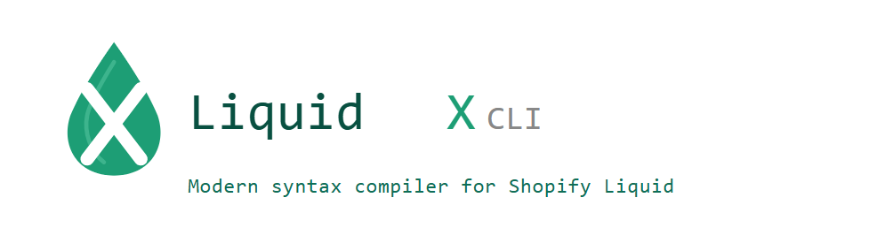

<p align="center">
  
</p>

# LiquidX CLI

**Modern syntax compiler for Shopify Liquid**

Shopify theme development often means fighting the same Liquid patterns over and over: mapping badge keys to asset filenames, writing tiny `if/else` blocks for stock messages, and watching section files grow harder to read with every feature. Liquid has no native object/map ergonomics and no shorthand for inline conditionals — so teams copy-paste boilerplate or bury logic in long `if` chains.

**LiquidX solves that** by giving you a TypeScript-like authoring layer: write concise LiquidX syntax locally, compile to standard Shopify Liquid, and ship only what Shopify understands. No custom runtime on the storefront — just cleaner source files and predictable compiled output.

LiquidX CLI is the compiler that powers that workflow: one command turns `template.liquid` into `template.compiled.liquid` in the same folder, ready for theme preview or deploy.

---

## Table of Contents

- [What Is LiquidX CLI](#what-is-liquidx-cli)
- [Why It Exists](#why-it-exists)
- [Features](#features)
- [Installation](#installation)
- [Quick Start](#quick-start)
- [Tutorial: Using LiquidX in Theme Development](#tutorial-using-liquidx-in-theme-development)
- [Best Use Cases](#best-use-cases)
- [Syntax Guide](#syntax-guide)
- [Before and After Examples](#before-and-after-examples)
- [CLI Guide](#cli-guide)
- [Project Structure](#project-structure)
- [Development Guide](#development-guide)
- [Troubleshooting](#troubleshooting)
- [Roadmap](#roadmap)
- [License](#license)

---

## What Is LiquidX CLI

LiquidX CLI is a Node.js command-line tool that compiles `.liquid` files written with LiquidX extensions into standard Shopify Liquid output.

Input:

```text
template.liquid
```

Output:

```text
template.compiled.liquid
```

The compiled file is generated in the **same folder** as your source file.

---

## Why It Exists

| Pain in plain Liquid | What LiquidX gives you |
|----------------------|-------------------------|
| Verbose `if/else` for one-line UI text | `lx-if` shorthand |
| Awkward key→value mapping in templates | Map/object `assign` syntax |
| Large sections that are hard to review | Shorter, intent-focused source files |
| Fear of non-standard syntax in production | Compile step outputs 100% Shopify Liquid |

You keep editing readable source; Shopify only ever sees compiled Liquid.

---

## Features

- **Map/object syntax**
  - Write compact object-style assign blocks
  - Compile to standard Liquid `case/when` structures

- **`lx-if` shorthand**
  - Write concise inline conditional tags
  - Compile to standard `......`

- **Developer-first CLI workflow**
  - Clear logs (`Compiling...`, `Done ✔`)
  - Safe file output strategy
  - Easy local testing

---

## Installation

### Global install (recommended)

```bash
npm install -g liquidx-cli
```

### Local project usage

```bash
npm install
node ./bin/liquidx.js ./examples/sample.liquid
```

---

## Quick Start

1. Create or use a Liquid file with LiquidX syntax:

```liquid


```

2. Run the compiler:

```bash
liquidx ./examples/sample.liquid
```

3. Expected CLI output:

```text
Compiling sample.liquid...
Done ✔ sample.compiled.liquid
Compiled: sample.liquid -> sample.compiled.liquid
```

4. Open the generated file:

```text
./examples/sample.compiled.liquid
```

---

## Tutorial: Using LiquidX in Theme Development

This walkthrough shows how to use LiquidX in a real Shopify theme workflow.

### Step 1: Choose a file to author with LiquidX

Pick a section or snippet where Liquid gets repetitive (for example: badges, status labels, or inline messaging).

Example source file:

```text
sections/main-product.liquid
```

### Step 2: Add LiquidX syntax where it improves readability

Use map/object syntax for value mapping and `lx-if` for inline conditionals.

```liquid

<p></p>
```

### Step 3: Compile the file

```bash
liquidx ./sections/main-product.liquid
```

Generated output:

```text
./sections/main-product.compiled.liquid
```

### Step 4: Use the compiled file for deploy/runtime

Shopify should receive standard Liquid (`.compiled.liquid`), while your team keeps editing the cleaner LiquidX source.

### Step 5: Repeat as part of your normal theme loop

- edit LiquidX source
- compile
- preview/push theme

If you use the VS Code extension, this can be one command (or compile on save).

---

## Best Use Cases

LiquidX is most valuable when you want cleaner authoring for patterns Shopify Liquid makes verbose.

### 1) Inline UI text decisions

Use `lx-if` for short conditional text in product cards, badges, stock messages, or shipping notes.

### 2) Mapping small value dictionaries

Use object/map syntax to define display mappings such as:

- status -> label
- badge key -> asset filename
- variant type -> icon name

### 3) Large theme files that need readability

For long files like `main-product.liquid`, LiquidX helps reduce visual noise where repetitive micro-logic appears.

### 4) Team workflows with source vs deploy artifacts

Teams can keep a readable authoring layer (`*.liquid`) and deploy a strictly compatible layer (`*.compiled.liquid`).

### 5) Incremental adoption in existing themes

You can adopt LiquidX gradually, section-by-section, without rewriting the whole theme.

---

## Syntax Guide

### 1) Map/Object Syntax

LiquidX input:

```liquid

```

Compiles to:

```liquid

 badge-new.svg
 badge-sale.svg

```

### 2) `lx-if` Shorthand

LiquidX input:

```liquid

```

Compiles to:

```liquid
 In stock - ships today  Sold out - notify me 
```

---

## Before and After Examples

### Example A: Product availability

Before:

```liquid
<p></p>
```

After:

```liquid
<p> Available now  Unavailable </p>
```

### Example B: Badge selection map

Before:

```liquid

```

After:

```liquid

 new.svg
 sale.svg
 limited.svg

```

---

## CLI Guide

### Command

```bash
liquidx <path-to-template.liquid>
```

### Help

```bash
liquidx --help
```

### Behavior Summary

- Validates that input file ends with `.liquid`
- Reads source file
- Runs compiler transforms
- Writes `<name>.compiled.liquid` in same directory

---

## Project Structure

```text
bin/               # CLI entrypoint
lib/               # Core compiler + transform layers
examples/          # Realistic LiquidX input files
docs/              # Architecture notes
test/              # Manual test runner
vscode-extension/  # VS Code extension
```

Architecture overview:

- `bin/liquidx.js` -> thin executable entrypoint
- `lib/cli.js` -> CLI orchestration + UX logs
- `lib/compiler.js` -> transform pipeline
- `lib/transforms.js` -> syntax-specific transforms
- `lib/file-system.js` -> file operations

---

## Development Guide

### Install dependencies

```bash
npm install
```

### Run manual validation

```bash
node ./test/run.js
```

This script:

- Loads `examples/sample.liquid`
- Runs the compiler
- Prints source and compiled output to console

### Add a new syntax feature

1. Add a new transform function in `lib/transforms.js`
2. Export it and include it in `DEFAULT_TRANSFORMS`
3. Add/extend an example in `examples/`
4. Validate using `node ./test/run.js`

---

## Troubleshooting

### `Input file not found`

Make sure the path is correct and relative to your current working directory.

### `Input file must use the .liquid extension`

The CLI currently accepts only files ending with `.liquid`.

### SSH push fails on GitHub

If `git push` over SSH fails on your network, switch remote URL to HTTPS:

```bash
git remote set-url origin https://github.com/<your-user>/<your-repo>.git
```

---

## VS Code Extension

A first-party extension lives in `vscode-extension/`.

**Commands**

- `LiquidX: Compile Active File` (`Ctrl+Shift+L` / `Cmd+Shift+L`)
- `LiquidX: Compile and Open Output`

**Settings**

- `liquidx.compileOnSave` — compile on save
- `liquidx.openCompiledFile` — open `*.compiled.liquid` after compile
- `liquidx.cliPath` — optional CLI path override

**Run locally (Extension Development Host)**

1. Open this repository in VS Code
2. Press `F5` (uses `.vscode/launch.json`)
3. Open a `.liquid` file in the new window and run **LiquidX: Compile Active File**

See `vscode-extension/README.md` for full extension docs.

---

## Roadmap

- AST parser upgrade
- Shopify CLI integration
- Publish LiquidX extension to VS Code Marketplace

---

## License

MIT. See `LICENSE`.

---

## Credits

Developed By Nyasha Madzokete
